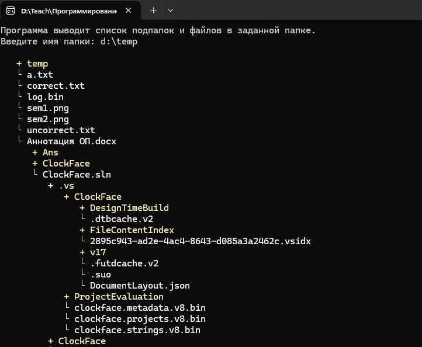

Данное задание направлено на изучение тем:

рекурсия,
хорошее оформление кода (константы, процедурный подход, необязательные аргументы),
самостоятельное изучение библиотек MS VS.
Разработайте функцию, которая по адресу папки выводит на экран список всех файлов в этой папке и из всех ее подпапках. Для решения задачи примените рекурсивный подход.

Используйте пространство имен System.IO (классы Directory и Path) для получения информации о папках и подпапках.

Оцениваться будет в том числе удобство восприятия иерархической структуры пользователем. При необходимости используйте псевдографику и цвет текста.

Обработку ошибок можно не делать.
Примерный вариант реализации можно посмотреть в прилагаемом файле или на скриншоте.

